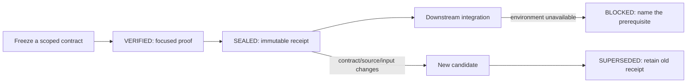

# A Passing Test Is Not a Release

## The failure that looks like caution

An agent proves a module, produces an artifact, and then reaches an unavailable
signer, VM, account, or production-like service. The next report says the
release cannot be assembled. On the following turn, the agent reads the module
again, reruns the same tests, or puts the already proven code back into the
global list of missing things.

That feels conservative, but it is a status-modeling bug. A blocked downstream
environment is evidence about the downstream environment. It is not evidence
that an unchanged upstream candidate stopped working.

The opposite mistake is just as dangerous: treating one passing test as proof
that a whole release is ready. A good workflow has to preserve the proof it
has, without promoting it beyond what it says.

The useful unit is a **proven stage contract**. It carries an immutable
identity, a narrow acceptance contract, outputs, and a fresh verdict into the
next stage. It does not replace testing, deployment checks, or human release
authority.

## Four states, not one overloaded "done"

| State | What it says | What it does not say |
|---|---|---|
| `VERIFIED` | Scoped behavior passed at an exact identity. | A later stage may consume it. |
| `SEALED` | The verified stage has a contract digest, source identity, input/output digests, and a fresh verdict. | The whole release is ready. |
| `BLOCKED` | This stage cannot proceed because a named prerequisite is unavailable. | Any sealed parent became invalid. |
| `SUPERSEDED` | A contract, source, or input changed and a newer stage replaces this one. | Historical evidence was rewritten. |

`SEALED` is the important boundary. It means a child may refer to the exact
output of its parent, rather than rebuilding an approximation of it in every
environment.



This is deliberately not a release-state machine. One release may have a
sealed source stage, a sealed binary stage, and a blocked signing stage. Each
statement remains true at the same time.

## What a sealed receipt contains

The minimum receipt answers five questions without relying on a chat summary:

1. **What was accepted?** A frozen acceptance contract and its digest.
2. **Which source was tested?** The Git commit and tree identity.
3. **What went in and came out?** Named input and output digests.
4. **Who checked it after the build?** A fresh verdict with its own digest.
5. **What invalidates it?** Contract, source, and input changes.

Keep this in the project-owned durable proof location, normally
`.proof/stage-ledger.json`. A downstream record consumes a parent output by
digest. If it needs an unavailable signer or VM, it records a `BLOCKED` state
and names that prerequisite. It does not alter the parent receipt.

The working schema and validator live in
[`proof-verify`](../skills/development/proof-verify/references/proven-stage-contracts.md).
For a project with the configuration checked out locally:

```text
python /path/to/claude-code-config/skills/development/proof-verify/scripts/validate_stage_ledger.py \
  .proof/stage-ledger.json
```

The validator rejects a child that consumes an unsealed parent, uses a changed
parent-output digest, or claims `SEALED` without the contract/source/input
invalidation keys. It validates the receipt's structure; it cannot make an
unavailable external service healthy.

## Promotion is not rebuilding

The reliable sequence is small:

1. Freeze the stage's acceptance contract.
2. Run the smallest focused proof that can disprove that stage.
3. Use a fresh evaluator for high-risk or release-directed work.
4. Seal the exact source, inputs, outputs, and verdict.
5. Let the next stage consume the exact sealed output.
6. If the next stage lacks infrastructure, record `BLOCKED` there.
7. If an invalidating input changes, create a new candidate and mark the old
   receipt `SUPERSEDED`.

This mirrors the provenance model used in modern release systems. SLSA defines
provenance as verifiable information that traces an artifact through a supply
chain to its origin, while GitHub's attestations tie build artifacts to how and
where they were built. [SLSA Provenance](https://slsa.dev/spec/v1.2/provenance)
and [GitHub artifact attestations](https://docs.github.com/en/actions/how-tos/secure-your-work/use-artifact-attestations/use-artifact-attestations)
are stronger infrastructure-level versions of the same idea. Google Cloud
Deploy likewise promotes an existing release to another target instead of
silently treating every target as a brand-new build. [Google Cloud Deploy
promotion](https://cloud.google.com/sdk/gcloud/reference/deploy/releases/promote)

The local ledger is not a replacement for those platforms. It is the smallest
portable form of the same boundary for a repository, a VM test, a signed binary,
or an agent workflow.

## Where this should not be used

The easiest way to ruin a good model is to apply it to every edit. Do **not**
create a stage ledger for:

- documentation-only work;
- one local function with no downstream hand-off;
- a short experiment whose result will be discarded or immediately folded into
  the same change;
- ordinary focused test runs that do not become an input to another environment
  or team.

Those need normal source control and risk-proportionate tests, not a miniature
release ceremony. The ledger starts when an independently verified result must
survive time, another agent, another environment, or a missing external
dependency.

## What the harness does, and does not automate

This repository wires the pattern at three levels:

- [`quality-code`](../rules/quality-code.md) defines the status vocabulary and
  forbids a later blocker from erasing upstream proof.
- [`proof-verify`](../skills/development/proof-verify/SKILL.md) supplies the
  receipt model, promotion rules, and validator.
- [`plan-gate.py`](../hooks/plan-gate.py) gives a once-per-day, non-blocking
  reminder when a prompt looks like multi-stage release work but the project has
  no stage ledger.

The hook is intentionally advisory. It can recognize words such as "release",
"signer", or "VM", but it cannot know whether a particular project has a real
promotion boundary. The project still owns the contract, the evidence, and the
decision to seal it.

That restraint matters. A good harness makes the next correct action easier; it
does not convert every passing test into paperwork or every blocked service into
a reason to redo work that has already been proved.

## Limits worth keeping visible

A sealed receipt is not a security certificate, a production deployment, or a
promise that every environment is ready. It says one bounded thing: this
candidate satisfied this contract with these inputs and outputs. The next stage
still needs its own focused proof, and a release still needs the authority and
environment it actually depends on.

NIST's Secure Software Development Framework also treats provenance as one
piece of a secure delivery practice, alongside the surrounding development and
verification work. [NIST SSDF](https://csrc.nist.gov/projects/ssdf)

That is the whole point of the model: keep evidence narrow enough to be true,
durable enough to be reused, and explicit enough that a missing external
dependency cannot quietly rewrite history.
