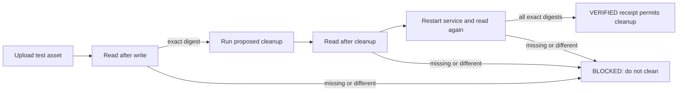

# A Save Log Is Not a Retention Guarantee

## The claim that must stop the cleanup

An agent says that photos and documents are retained, then prepares a cleanup.
The only observation behind the statement is a journal containing user messages
or a code path named `save`. Neither tells us whether an uploaded asset was
stored, can still be read, survives the cleanup, or survives a restart.

The correct status is not "data loss" and not "retention verified." It is
`BLOCKED`: the preservation property has not been measured. Stopping cleanup at
that point is a safety control, not an incomplete implementation.

This is a general incident pattern, not a claim about a particular bot. A log
can prove that an event was emitted. It cannot prove that a different system
durably accepted bytes, indexed them, or will serve them later.

## A retention claim needs an end-to-end receipt

Before a destructive cleanup, a project-owned validator should create one
durable receipt per tested asset class. The cleaner consumes the receipt, not a
chat summary or a success log.

```text
operation_id: <unique test run>
asset_class: photo | document
source_digest: sha256:<uploaded bytes>
storage_locator: <opaque object or record id>
write_probe: PASS | BLOCKED
read_after_write_digest: sha256:<downloaded bytes>
read_after_cleanup_digest: sha256:<downloaded bytes>
read_after_restart_digest: sha256:<downloaded bytes>
checked_at: <UTC timestamp>
verdict: VERIFIED | BLOCKED
```

The values must come from the actual upload, storage/API read, and restart
probe. A filename, database row, handler return value, or application log is
useful diagnostic context, but is not a substitute for the three read probes.

The receipt may contain opaque identifiers instead of customer data. Keep it in
the private project evidence store when paths, object ids, or media metadata are
sensitive; the public contract describes the fields and invariants only.

## The cleanup boundary

The safe state machine is small:



`BLOCKED` means the cleanup does not run. It does not mean that the storage
implementation is wrong; it means the system lacks evidence strong enough to
delete its neighbouring data safely. A later successful probe can create a new
receipt. It must not edit a failed or blocked receipt into a success.

## The minimum test set

Run these with disposable, non-user test assets in an isolated namespace:

1. Upload one image and one representative document. Read each back and compare
   the source and returned SHA-256 digests.
2. Run the exact cleanup candidate. Read both assets again and compare digests.
3. Restart the service or worker responsible for retrieval. Read both assets a
   third time and compare digests.
4. Simulate a false success: let the write handler report success without a
   durable object. The validator must return `BLOCKED`, and the cleaner must not
   execute.
5. Make the storage read unavailable. The result must be `BLOCKED`, never a
   guessed pass inferred from logs.

Do not reuse real customer media as a fixture. The point is to test the storage
and retrieval contract, not to create another private-data copy.

## What a general harness can and cannot do

[`outward-claim-evidence-guard.py`](../hooks/outward-claim-evidence-guard.py)
prevents a final report from casually turning a storage hypothesis into a claim
about a hash, size, version, or deployment. The related
[`no-guessing`](../rules/no-guessing.md) rule requires `Claim`, `Evidence`, and
`Scope` for externally measurable facts.

That guard is deliberately not a retention validator. It can see an unmeasured
sentence; it cannot upload an asset, read the provider's object store, or prove
what a specific bot should preserve. The bot therefore needs its own narrow,
repository-owned retention gate and end-to-end fixtures.

This boundary is supported by evaluation research: self-authored verification
can report success more often than independent or deployment-grounded checks.
[AnalysisBench](https://arxiv.org/abs/2604.11270) and
[SEAL](https://arxiv.org/abs/2607.24300) motivate the separation, but neither
paper proves retention for an individual service. Only the live receipt does.

## A report that stays true

Until the receipt exists, the correct report is concise:

```text
Claim: Asset retention across cleanup is not confirmed.
Evidence: The available journal contains message events but no successful
          storage-read or restart probe for photo/document assets.
Scope: Cleanup is blocked; no conclusion about existing user assets is drawn.
```

That is stronger than a reassuring sentence. It preserves the unknown, makes
the next probe obvious, and stops a destructive action from depending on an
unmeasured assumption.
