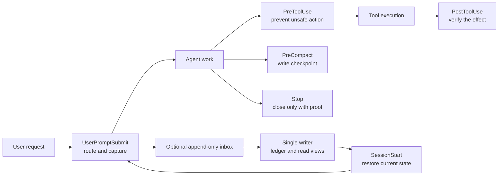

# Runtime Wiring And Verification

This repository is the source of truth for shareable rules, hook scripts, and
skills. Each agent client has its own small runtime configuration that points to
those files. A rule is not considered adopted until its wiring and its test both
pass.

## Policy Boundaries

- Git first: durable project code, documentation, plans, proofs, and handoffs
  belong in a repository. New operational repositories are private unless the
  user explicitly requests public visibility.
- Documentation is mandatory for a project that adopts the long-run harness.
  `feature_list.json` without a KB blocks session completion; a project KB
  validator also blocks completion when agent docs no longer match its code.
- Git source-of-truth setup is mandatory for the same adopted projects:
  `git-source-gate.py` blocks completion until the project has a Git worktree
  and an `origin` remote. It deliberately does not force commits for an
  arbitrary dirty tree, because a global hook cannot safely classify another
  person's changes.
- Scratch folders are not documentation-gated. The long-run marker is the
  explicit boundary that turns the gate on.
- Client-specific or private-only overlays may add local handlers, but this
  public repository documents and tests only handlers it actually contains.
- Raw session archives and operational credentials are private-only and are not
  part of this public repository.
- High-frequency runtime reports are regenerable operational state. Route them
  with `--report-dir` outside a project worktree; keep durable conclusions in a
  handoff, chronicle, test artifact, or commit instead.

## Runtime Contract

| Concern | Codex desktop | Claude Code | Proof |
|---|---|---|---|
| Destructive-operation guards | `PreToolUse` | `PreToolUse` | hook eval cases |
| Dependency supply-chain guards | `PreToolUse` on manifest edits and install commands | `PreToolUse` on manifest edits and install commands | `scripts/test_dependency_provenance_guard.py` + both guard self-tests + `scripts/dependency-alternatives.py --self-test` |
| Test scope and overload routing | `Stop` | `Stop` | `scripts/test_test_strategy.py` + `scripts/test_high_risk_review_gate.py` + `scripts/test_harness_load_advisor.py` |
| Measured outward facts | `Stop` | `Stop` | `scripts/test_task_completion_hooks.py` (hash claim red/green fixtures) |
| Handoff completeness | `PreToolUse`, `Stop`, `PreCompact` | `PreToolUse`, `Stop`, `PreCompact` | `test_task_completion_hooks.py` |
| Handoff to memory continuity | `SessionStart` | `SessionStart` | `test_review_handoff_memory_loop.py` |
| Claude/Codex continuation contract | `PreToolUse`, `SessionStart` | `PreToolUse`, `SessionStart` | `scripts/test_continuity_contract.py` |
| Agent-doc freshness | `SessionStart` advisory + `Stop` gate | `SessionStart` advisory + `Stop` gate | hook self-tests |
| Git source-of-truth setup | `Stop` for long-run projects | `Stop` for long-run projects | `test_lifecycle_hook_contracts.py` |
| File transfer continuity | `PreToolUse` + `PostToolUse` + `Stop` | `PreToolUse` + `PostToolUse` + `Stop` | `scripts/test_transfer_contract.py` |
| Skills availability | active skill directory | `~/.claude/skills` | `sync_skills_to_codex.py --check --also-claude` and `skills-lock.json` |
| Skills survive a machine/account move | active skill directory | `~/.claude/skills` | `recover_skill_trees.py --report` |
| Optional RTK output compression | instruction-level (`AGENTS.md`) | native `PreToolUse` hook | `scripts/test_rtk_integration.py` plus pinned binary verification |

Codex's current plugin loader accepts only a top-level `hooks` object in cached
plugin hook files. `repair_codex_plugin_hook_schema.py --fix` safely removes the
otherwise harmless Claude-compatible `description` field and preserves a backup.

## Hook Lifecycle And Continuity

The contract table names which runtime proves each concern. This map names when
the work happens. Hooks in the synchronous agent path capture a small event or
check one focused invariant; full archive sync, search indexing, embedding, and
research enrichment run outside that path.

## Context Budget And Hook Admission

Context discipline is an architecture constraint, not an invitation to put every
good idea into `UserPromptSubmit` or `Stop`. The default shape is one semantic
skill router, narrow event-matched guards, and JIT skill loading. Full archive
search, graph rebuilding, embeddings, and broad audits stay outside the
synchronous hook path.

Add a hook only when all four answers are concrete:

1. What observed failure or project risk does it own?
2. What narrow event and input does it need?
3. What deterministic red/green fixture proves it fires and stays quiet?
4. Which aggregate signal or review removes it if it proves noisy or redundant?

A hook count alone is not a latency or false-positive measurement. Do not claim a
harness is low-noise until a real event sample exists; report `UNOBSERVED` rather
than manufacturing a clean verdict. This follows Anthropic's guidance to pass the
right context precisely and to use structured handoffs across fresh sessions, not
an ever-growing active prompt ([long-running harness design](https://www.anthropic.com/engineering/harness-design-long-running-apps)).



| Lifecycle stage | Responsibility | Boundary |
|---|---|---|
| `UserPromptSubmit` | Route high-confidence skills, surface an open work order, or record a small request event. | Never scan a transcript archive or build an index synchronously. |
| `SessionStart` | Validate configuration and show the current handoff, continuation contract, or open work. | Read durable state; do not infer completion from a prior chat response. |
| `PreToolUse` | Deny unsafe operations or require the proof/contract that the script owns. | Match narrowly; a script must not silently approve unrelated work. |
| `PostToolUse` | Verify an observable consequence, or emit an advisory signal. | A command's exit text alone is not proof that deletion, transfer, or launch succeeded. |
| `PreCompact` | Preserve a compact checkpoint before context is condensed. | A fallback draft is evidence of risk, not a substitute for a reviewed handoff. |
| `Stop` | Enforce handoff, test, tracked-work, and narrowly scoped evidence closure conditions. | A completion claim needs durable evidence; an unresolved item needs an explicit recorded status. Do not turn it into a generic natural-language fact checker. |

For a long-running, multi-session project, record request and status changes as
append-only events. A single writer can turn them into a canonical ledger and
small read views such as active tasks. This avoids concurrent sessions corrupting
a shared JSON/Markdown state file. Keep raw transcripts, credentials, and
operational research in the private archive; the public repository documents
only the pattern and the shareable handlers.

Other clients can use the same lifecycle stages, but must map them to their own
native events and permission model. Do not copy Claude Code event names into a
different client without running the runtime wiring tests.

## Skill routing layers

There are two deliberately separate routing layers:

1. The agent client's semantic loader reads each skill's `SKILL.md` frontmatter
   (`name` and `description`) and decides which skill body to inject. A skill's
   `agents/openai.yaml` may set `policy.allow_implicit_invocation: false`; the
   default is `true`. This is the mechanism that handles the full skill catalog.
2. `hooks/keyword-skill-router.py` is a small, curated `UserPromptSubmit`
   advisory. It catches only high-confidence phrases and prints a suggestion;
   it does not inject a skill and must not become a second copy of the whole
   semantic catalog.

A skill the loader cannot read is absent no matter how correct the routing is.
After a machine or account move, verify the catalog itself before trusting either
layer: dangling cross-profile links, empty directory shells and a UTF-8 BOM each
hide a skill without producing an error. See
[skill-tree-recovery.md](skill-tree-recovery.md).

```bash
python scripts/recover_skill_trees.py --report
```

Run the live boundary audit after changing either side:

```bash
python scripts/audit_skill_hook_wiring.py --strict
```

The audit checks active and source skill metadata, implicit-invocation flags,
all configured hook command targets, the live UserPromptSubmit wiring, and every
curated router target. Duplicate nested plugin copies are reported as warnings;
they are not silently treated as one canonical skill.

## Verification

Run the following after changing the public configuration. The final two commands
also prove the locally installed runtime, so run them after installation.

```bash
python scripts/validate_config.py --strict
python scripts/generate_skills_lock.py --check
python scripts/generate_skills_catalog.py --check
python evals/hooks/run_hook_evals.py
python scripts/test_lifecycle_hook_contracts.py
python scripts/test_task_completion_hooks.py
python scripts/sync_skills_to_codex.py --check
```

For a plugin update that causes a hook-schema error:

```bash
python scripts/repair_codex_plugin_hook_schema.py --fix
python scripts/test_task_completion_hooks.py
```

The standard Claude Code hook format and lifecycle are documented in the
[Claude Code hooks reference](https://code.claude.com/docs/en/hooks). Codex and
Claude are intentionally verified separately because their configuration parsers
and available tool names differ.

## What The Evidence Means

Skill linting, the portable lockfile, and synchronization prove that a skill is
valid, versioned, and available to the client. The lock normalizes UTF-8 text
newlines, so the same checkout verifies on Windows and Linux. Router evals prove
selected automatic suggestions; the wiring audit proves that those suggestions
cannot point at missing skills. Neither proves that every piece of advisory
knowledge improves every task. Promote a skill to a mandatory route only after
a task-specific before/after evaluation with a measurable acceptance criterion.

## Continuation Contract

When a project declares `mode: continuation` in `CONTINUITY.json`, the guard
protects existing tracked files from silent whole-file rewrites and can enforce
the claimed scope. Intentional redesign requires `AGENT_CONTINUITY_MODE=replan`
and a non-empty `AGENT_CONTINUITY_REASON` recorded in the handoff.
