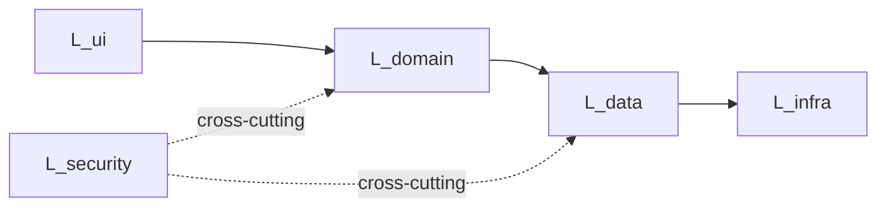

# docs/layers -- Project layer architecture

Each subdirectory is a **layer**: a bounded concern such as `security`,
`data`, `ui`, `infrastructure`, `domain`. Layers are organizational,
not directory-based -- a single file may participate in multiple
layers, and a single layer covers multiple files.

See [principle 28 - Feature-Layer Architecture](https://github.com/AnastasiyaW/claude-code-config/blob/main/principles/28-feature-layer-architecture.md)
for the full rationale.

## Quick adoption

Create a new layer from the template:

```bash
cp -r _LAYER-TEMPLATE <new-layer-name>
# fill in the README, then write your first feature
cp <new-layer-name>/features/_FEATURE-TEMPLATE.md \
   <new-layer-name>/features/feat-001-<slug>.md
```

Or use the skills:

```
/layer-new <name>          # scaffold a layer
/feature-new <layer> <slug># scaffold a feature in an existing layer
```

## Structure of a layer

```
<layer>/
├── README.md           # Purpose, governing principles, features index
├── history.md          # Evolution timeline (reverse chronological)
├── kb/
│   ├── invariants.md   # Layer-scoped hard rules (IV-N)
│   ├── decisions.md    # Layer-scoped ADRs (D-N)
│   ├── gotchas.md      # Known foot-guns (G-N)
│   └── patterns.md     # Reusable recipes (PT-N)
└── features/
    ├── _FEATURE-TEMPLATE.md
    └── feat-NNN-<slug>.md  # ULTRAPACK-style narrative per feature
```

## Layer index

<!-- Update this table when adding/retiring layers. The validator
will flag if a directory under layers/ has no entry here. -->

| Layer | Purpose | Status |
|-------|---------|--------|
| <example> | <one-line purpose> | active |

## Cross-layer dependencies

<!-- Optional but recommended for projects with 5+ layers: a Mermaid
graph showing which layer reads from / writes to which. Helps catch
hidden circular dependencies before they become entrenched. Can also
be auto-generated by `scripts/build_kb_graph.py`. -->



## Generated files

The following files in `_graph/` are auto-generated. Do not edit
manually:

- `_graph/tree.md` -- full feature graph as Mermaid
- `_graph/backlinks.json` -- who references whom
- `_graph/health.md` -- broken-link and consistency report

Regenerate with: `python scripts/build_kb_graph.py`.
