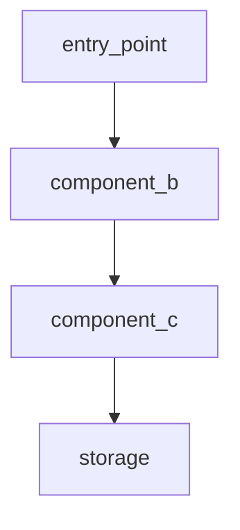

# F-NNN: <feature title>

<!-- This is the ULTRAPACK-style narrative for one feature. It is
human-readable rationale. Machine state lives in
feature_list.json. Incident reports live in PROBLEMS.md. Cross-session
tactical handoffs live in handoffs/. Don't duplicate. -->

**Layer:** [<layer-name>](../README.md)
**Status:** design
**Branch:** feature/<slug>
**Started:** YYYY-MM-DD
**Owner:** <name>

**Implements invariants:** [IV-N](../kb/invariants.md#iv-n)
**Touches layers:** <primary>, <secondary>
**Related features:**
- depends-on: <F-MMM linked or "none">
- enables: <F-NNN linked or "none">
- supersedes: <F-NNN linked or "none">

---

## Design

### Approach

<One paragraph: what the problem is, what we are going to do at a high
level. No code. Two-thirds of features need only this and the
invariants below.>

### Invariants (feature-local)

<!-- IV-N here are scoped to this feature. If one earns broader scope
later, promote it to the layer kb/invariants.md and reference the
promoted ID instead. -->

- **IV-1:** <one-line statement of what MUST be true after this feature>.
- **IV-2:** <one-line statement>.

### Principles (PC-N)

<!-- PC-N are softer than invariants: guiding rules that shape the
implementation but may have edge-case exceptions. -->

- **PC-1:** <guideline statement>.

### Assumptions (AS-N)

<!-- AS-N are things we take as given. If an assumption turns out to be
wrong, that is a finding worth its own entry in gotchas.md. -->

- **AS-1:** <statement>. <How we verified or why we are taking it on faith>.

### Unknowns (UK-N)

<!-- UK-N are open questions. They must either be resolved before the
feature is done (move to Design body) or explicitly deferred to Future
work below. Unknowns left untouched at the end of a feature == bug. -->

- **UK-1:** <question>. <Why it matters>.

### Rejected alternatives

<!-- Each rejected alternative is a one-line description + one-line
reason. Future sessions will want to know what we considered. -->

- <Alternative A>: <why rejected>.
- <Alternative B>: <why rejected>.

---

## Plan

### Files affected

<!-- Path:line. Validator can verify the paths exist. New files marked
with :new. -->

- `path/to/file.py:42` -- <what changes>
- `path/to/new_file.py:new` -- <what the new file contains>

### Interfaces

<!-- Signatures only. No bodies. -->

```python
class NewThing:
    def method(self, arg: Type) -> ReturnType: ...
```

### Interface graph

<!-- Mermaid graph showing call order. Optional but useful for >5
interfaces. -->



### Phases

<!-- PH-N are topologically ordered. Same wave = can run in parallel.
Earlier wave = must complete before later. -->

- **PH-1** -- <description>. Wave 1.
- **PH-2** -- <description>. Wave 1.
- **PH-3** -- <description>. Wave 2 (depends on PH-1, PH-2).

### Test strategy

<!-- What tests cover what invariants. Each IV-N should have at least
one regression test by the time status moves to "done". -->

- IV-1 -- `tests/test_<area>.py::<test_name>`
- IV-2 -- `tests/test_<area>.py::<test_name>`

---

## Verify

<!-- Filled during the Verify phase, not at design time. -->

### Positive cases

- [ ] <case 1>: <expected behavior>
- [ ] <case 2>: <expected behavior>

### Negative cases

- [ ] <case 1>: <expected failure mode>
- [ ] <case 2>: <expected failure mode>

### Evidence

<!-- 3-Layer Validation Gate per CLAUDE.md global rules. Each layer
must have a durable artifact path; "I checked" without a file is not
evidence. -->

- **L1 (Syntax/Static):** `<command>` -- evidence at `<path>`.
- **L2 (Runtime):** `<command>` -- evidence at `<path>`.
- **L3 (System/E2E):** `<test description>` -- evidence at `<path>`.

---

## Conclusion

<!-- Filled when status moves to "done". Closed feature docs are
read-only; updates go into superseding features. -->

### Deviations from plan

<!-- Where implementation diverged from Plan, with justification. -->

### Hands-off decisions

<!-- If the agent ran in hands-off mode, list decisions made without
user input. Format: decision + justification (why this was the
conservative choice). -->

### Updated documents

<!-- Files whose canonical text changed because of this feature. -->

- `docs/layers/<L>/kb/invariants.md` -- added IV-N
- `docs/layers/<L>/kb/decisions.md` -- added D-N
- `docs/layers/<L>/history.md` -- new entry
- `docs/layers/<L>/README.md` -- updated features table
- `feature_list.json` -- F-NNN status: done

### Future work

<!-- Open items moved to backlog. Each future-work entry must be
either: a new feature draft (F-MMM in feature_list.json with
status: not-started), or an explicit UK-N moved to a new feature. -->

- F-MMM (not-started): <draft title>. Reason: UK-N from this feature.
